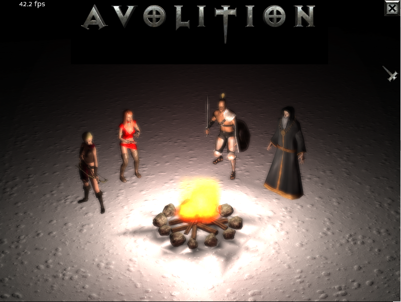
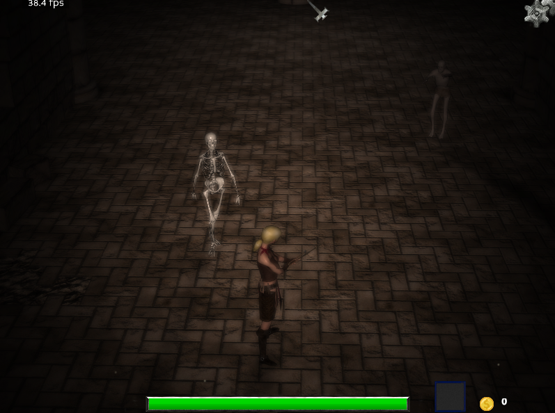
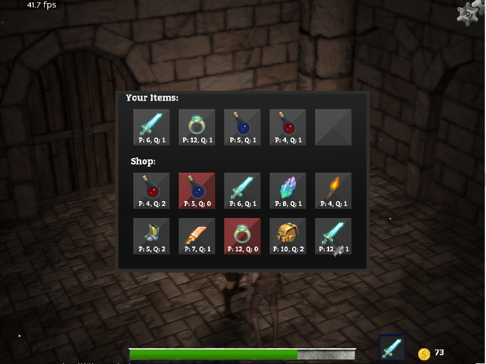
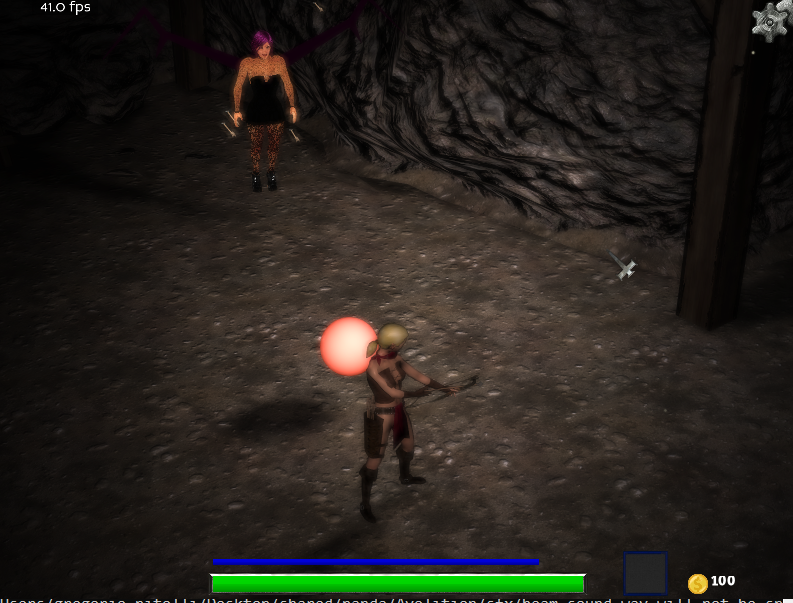
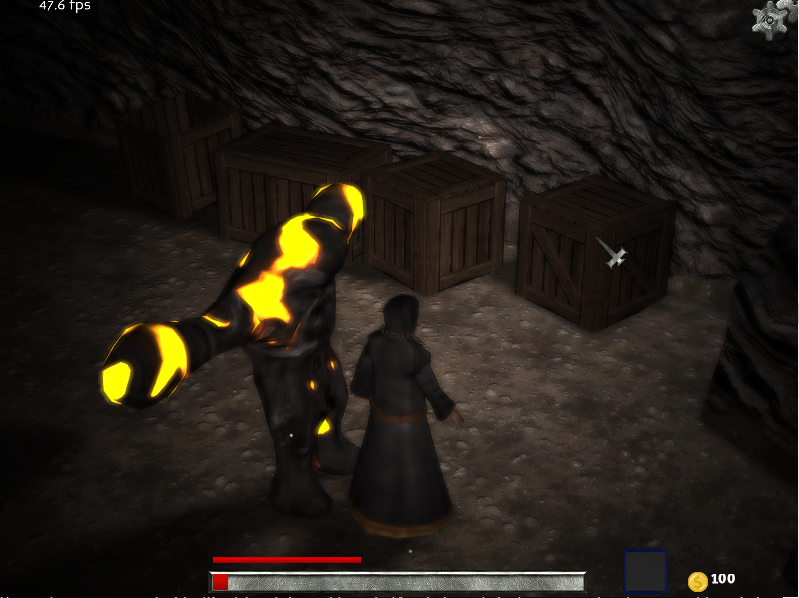
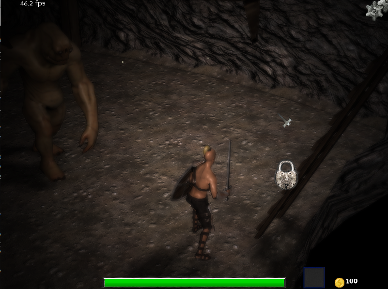

# Avolition 2

Avolition 2 is a cross-platform action RPG game based on [Avolition](https://github.com/wezu/Avolition) and the great [Panda3D](https://www.panda3d.org/) engine. I also used [Blender](https://www.blender.org/) for 3d modelling. The game is written in Python3.

The game starts choosing among four characters (Archer, Witch, Knight, Wizard), each character has its own abilities. You will explore dark dungeons, but pay attention they are full of monsters. There are even boss monsters that can be hard to defeat. You can collect coins and objects, buy new items from the shop to increase your power (don't worry, you don't have to spend real money). Find the keys and unlock the doors (click on the key icon to pick up it).
The shop contains several items you can buy, but they are limited and could not be available. When you restart the game the shop will be restocked.
The game will automatically save your progress each time you pass a level. Actually the game sometimes can lag or crash, over the time new fixes will be released and it should become more stable.
Kill the monsters to get the key!
If your FPS are too low try with a lower resolution.

# Screenshots

# Keys
The keyboard configuration is not updated in the game at the moment, thus I report here the current key bindings:
*  `w a s d` : move the character
*  `q e` : move the camera (note: zoom-in and zoom-out is disabled)
*  `mouse 1`: action 1
*  `mouse 3` or `spacebar`: action 2
*  `v` : View/Hide the items menu
*  `u` : use the current item
*  `i` : select the next item

# Installation
1.  Donwload the compressed archive (<200MB) or make a `git clone` (~500MB)
2.  Install the cross-platform Panda3D engine with `pip install panda3d`
3.  Run the game with `python main.py`

# Why Panda3D?
"Never say 'No' to panda"

I decided to approach the 3D game development using this framework, because Panda3D is very flexible and powerful. It was originally sponsored and used by Disney and Carnegie Mellon University's Entertainment Technology Center. The framework doesn't come with an IDE, but it provides you all the needed primitives (rendering, collisions, particles, etc.). The main target is python, however it supports also C++. I didn't find many open source games using it, thus I decided to make Avolition 2. It was mainly created as an exercise to learn Panda3D.

# Acknowledgements
Please see the [acknowledgements](acknowledgements.txt) for a complete list of the resources used by the game and a reference to their creators.
Thanks to everyone released free assets, sfx and other materials.
